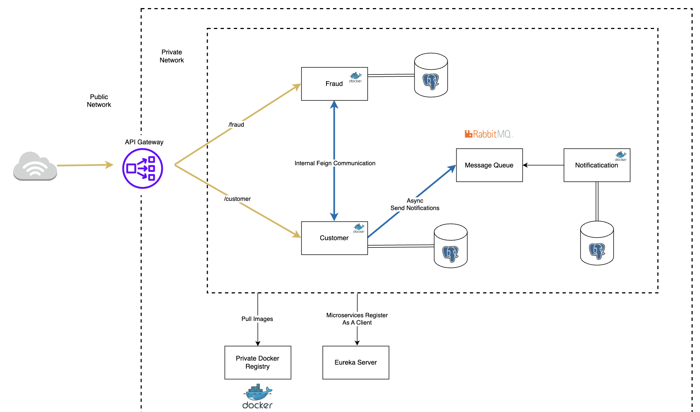

# Microservices-basic 🗿

## Description
This project is a simple microservices-usage realization...



## Technologies Used

- Eureka server
- Feign Client
- Spring Cloud Gateway
- Docker
- RabbitMq

## Microservices
- Customer 
- Fraud
- Notification

## Features

## Installation and Running
1. Clone the repository:
   ```bash
   git clone https://github.com/nibavs/microservices-basic.git
2. Make sure you have Java 17+ and Maven installed.
3. 


